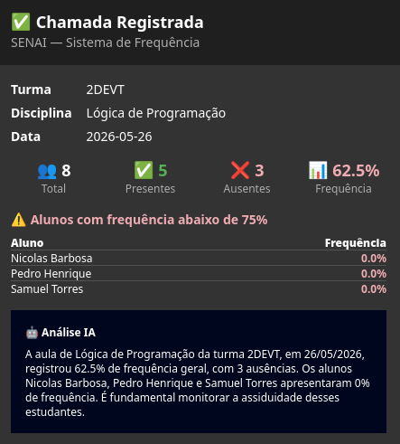
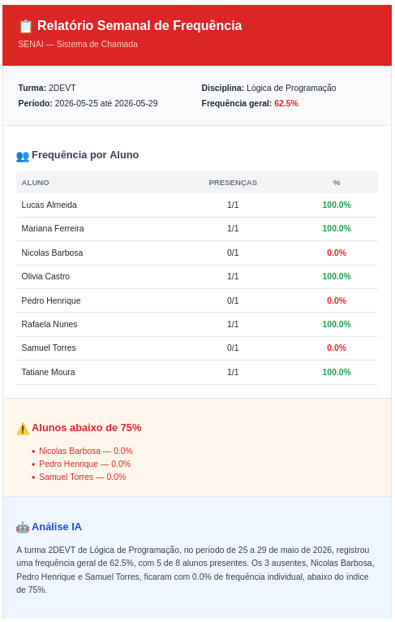

<div align="center">


<br/>


<br/>

> **Sistema web completo para controle de presença do SENAI Limeira.**
> Integração com Microsoft Teams, análise por IA e relatórios exportáveis — tudo na nuvem Azure.

<br/>

[](https://github.com)
[](https://github.com)
[](https://github.com)

</div>

---

## ✨ O que esse sistema faz?

```
Professor abre o sistema          →   Vê suas turmas do dia
Seleciona turma + disciplina      →   Lista de alunos carregada automaticamente
Desmarca os ausentes              →   Todos começam como presentes (agilidade máxima)
Confirma a chamada                →   Dados salvos no Azure SQL
                                  →   Microsoft Teams recebe notificação instantânea
                                  →   IA gera resumo inteligente da aula
                                  →   Alunos em risco são destacados automaticamente
                                  →   Relatório semanal enviado por email automaticamente
```

---

## 🚀 Features

<table>
<tr>
<td width="50%">

### 🎓 Gestão de Chamada
- ✅ Chamada rápida — todos presentes por padrão
- ✅ Suporte a alunos de disciplinas extras
- ✅ Histórico completo por turma e data
- ✅ 3 cursos técnicos: DS, Mecânica, Eletroeletrônica

</td>
<td width="50%">

### 📊 Dashboard & Relatórios
- ✅ Gráficos de frequência em tempo real
- ✅ Exportação em **Excel** com cores e formatação
- ✅ Exportação em **PDF** com layout profissional
- ✅ Filtros por turma, data e disciplina

</td>
</tr>
<tr>
<td width="50%">

### 🤖 Inteligência Artificial
- ✅ Resumo automático de cada chamada via **Gemini AI**
- ✅ Alerta de alunos abaixo de 75% de frequência
- ✅ Análise narrativa enviada direto no Teams
- ✅ Relatório semanal de frequência por **email automático**

</td>
<td width="50%">

### ☁️ Infraestrutura Azure
- ✅ Banco de dados **Azure SQL Database**
- ✅ Notificações via **Microsoft Teams Webhook**
- ✅ Adaptive Cards com layout rico e responsivo
- ✅ Arquitetura pronta para Azure AD SSO

</td>
</tr>
</table>

---

## 🏗️ Arquitetura

```
┌─────────────────────────────────────────────────────────┐
│                     FRONTEND                            │
│              SvelteKit + TypeScript                     │
│         Tailwind CSS · Chart.js · ExcelJS               │
└──────────────────────┬──────────────────────────────────┘
                       │ HTTP REST
┌──────────────────────▼──────────────────────────────────┐
│                     BACKEND                             │
│                FastAPI + Python                         │
│          SQLAlchemy ORM · Pydantic v2                   │
└──────────┬─────────────────────────┬────────────────────┘
           │                         │
┌──────────▼──────────┐   ┌──────────▼──────────────────┐
│   Azure SQL Database │   │     Serviços Externos       │
│   9 tabelas          │   │  🤖 Gemini AI (resumos)     │
│   Índices otimizados │   │  💬 Microsoft Teams         │
│   Soft delete        │   │     (Adaptive Cards)        │
└─────────────────────┘   │  📧 Gmail SMTP (relatórios) │
                           └─────────────────────────────┘
```

---

## 📁 Estrutura do Projeto

```
senai-lista-chamada/
├── 📂 backend-python/          # API FastAPI
│   ├── app/
│   │   ├── models/             # SQLAlchemy ORM (9 tabelas)
│   │   ├── schemas/            # Pydantic v2
│   │   ├── services/           # Lógica de negócio
│   │   │   ├── teams_service.py   # 🤖 IA + Teams Webhook
│   │   │   └── email_service.py   # 📧 Relatório semanal por email
│   │   ├── routers/            # Endpoints REST
│   │   ├── seed.py             # Dados de demonstração
│   │   └── main.py
│   └── requirements.txt
│
├── 📂 frontend/                # SvelteKit
│   └── src/
│       ├── routes/
│       │   ├── chamada/        # Fluxo de chamada
│       │   ├── relatorio/      # Relatórios + exportação
│       │   └── importar/       # Import de planilha Excel
│       ├── lib/
│       │   ├── components/     # Navbar, Cards, Gráficos
│       │   └── utils/          # Parser Excel
│       └── app.html
│
└── 📂 docs/                    # Documentação Obsidian
```

---

## ⚡ Como Rodar

### Pré-requisitos

```bash
# Backend
Python 3.12+
ODBC Driver 18 for SQL Server

# Frontend
Node.js 20+
```

### Backend

```bash
cd backend-python

# Instalar dependências
pip install -r requirements.txt

# Configurar variáveis de ambiente
cp .env.example .env
# Editar .env com suas credenciais

# Popular banco com dados de demonstração
python -m app.seed

# Iniciar servidor
uvicorn app.main:app --reload
# API disponível em http://localhost:8000
# Documentação em http://localhost:8000/docs
```

### Frontend

```bash
cd frontend

# Instalar dependências
npm install

# Iniciar servidor de desenvolvimento
npm run dev
# App disponível em http://localhost:5173
```

---

## 🔑 Variáveis de Ambiente

```bash
# backend-python/.env

# Azure SQL Database
DB_SERVER=seu-servidor.database.windows.net
DB_NAME=nome-do-banco
DB_USER=usuario
DB_PASSWORD=senha

# Microsoft Teams
TEAMS_WEBHOOK_URL=https://outlook.office.com/webhook/...

# Gemini AI
GEMINI_API_KEY=sua-chave-aqui

# Email (Gmail com senha de app)
EMAIL_USER=seuemail@gmail.com
EMAIL_PASSWORD=sua-senha-de-app
```

---

## 📡 Endpoints Principais

| Método | Rota | Descrição |
|--------|------|-----------|
| `GET` | `/turma-disciplinas/hoje` | Disciplinas do dia atual |
| `POST` | `/sessoes` | Criar sessão de aula |
| `GET` | `/sessoes/{id}/alunos` | Alunos da sessão |
| `POST` | `/chamadas/lote` | Registrar chamada completa |
| `GET` | `/chamadas/sessao/{id}` | Ver chamada registrada |
| `POST` | `/chamadas/relatorio-semanal` | Enviar relatório por email |
| `GET` | `/turmas` | Listar turmas |
| `GET` | `/alunos` | Listar alunos |
| `GET` | `/docs` | Documentação interativa Swagger |

---

## 🗄️ Modelo de Dados

```
roles ──── usuarios
              │
              ├── turma_disciplina ──── sessao_aula ──── presenca_alunos
              │         │
cursos ───────┤         │
              │         │
              └── turma ┴──── alunos ──── aluno_disciplina_extra
```

**9 tabelas** com integridade referencial, índices otimizados e soft delete em todas as entidades.

---

## 💬 Notificação no Microsoft Teams

<br>

Quando uma chamada é registrada, o sistema envia automaticamente um **Adaptive Card** no Teams com:

- 📊 Resumo da aula (turma, disciplina, data)
- 👥 Estatísticas de presença com indicadores visuais
- ⚠️ Lista de alunos abaixo de 75% de frequência
- 🤖 Análise narrativa gerada por IA

---

## 📧 Relatório Semanal por Email

<br>

Todo final de semana o sistema envia automaticamente um **relatório HTML** para cada professor com:

- 📊 Frequência geral da turma na semana
- 👥 Tabela detalhada por aluno com % colorida (verde ≥75%, vermelho <75%)
- ⚠️ Lista de alunos abaixo de 75% destacados em vermelho
- 🤖 Análise narrativa gerada por IA

> O envio também pode ser disparado manualmente via `POST /chamadas/relatorio-semanal`.

---

## 🛣️ Roadmap

- [x] Backend FastAPI + Azure SQL
- [x] Frontend SvelteKit + Tailwind
- [x] Dashboard com gráficos
- [x] Exportação Excel e PDF
- [x] Import de planilha Excel
- [x] Microsoft Teams Webhook + Adaptive Cards
- [x] Análise IA com Gemini
- [x] Relatório semanal por email com resumo IA
- [ ] QR Code de chamada
- [ ] PWA instalável
- [ ] Azure AD SSO
- [ ] Deploy Azure App Service

---

## 🎓 Sobre o Projeto

Desenvolvido como projeto de conclusão do curso Técnico em **Desenvolvimento de Sistemas** no **SENAI Limeira**.

Stack escolhida para máxima integração com o ecossistema Microsoft já utilizado pela instituição, com arquitetura preparada para escalar para produção real.

---

<div align="center">

**Desenvolvido com 🔥 para o SENAI Limeira**


</div>