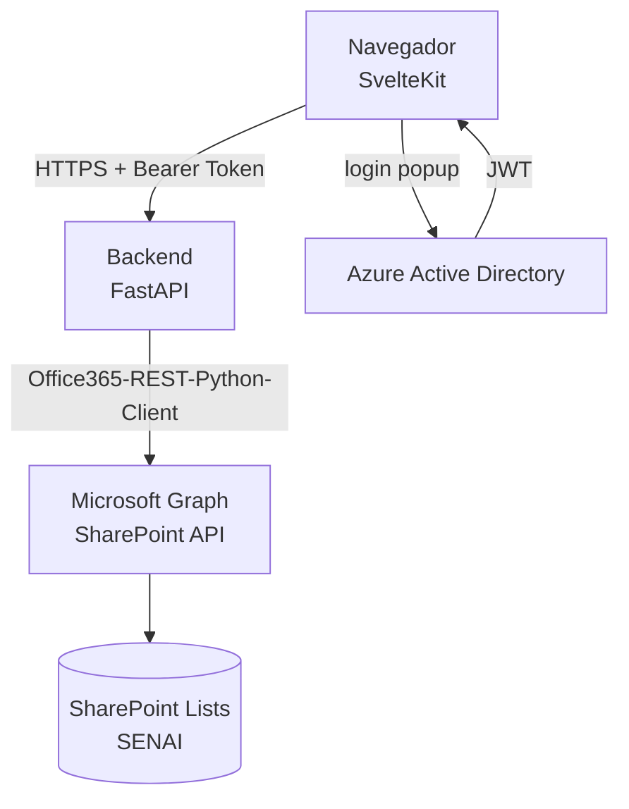
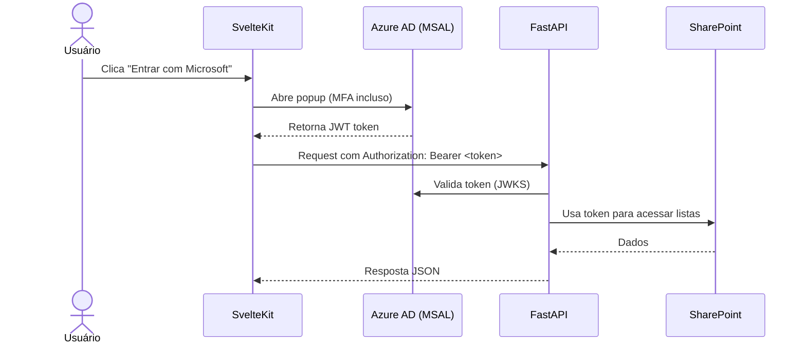
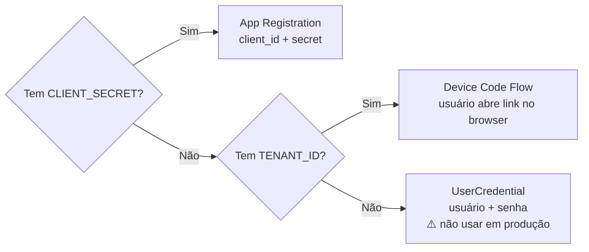

# Arquitetura

#senai #chamada #arquitetura #diagrama

> [[00 - Índice|← Índice]]

---

## Visão de componentes

---

## Fluxo de autenticação — Produção (planejado)

---

## Fluxo atual — Desenvolvimento

> A lógica de seleção está em [[06 - Autenticação]] → `microsoft_context.py`

---

## Links relacionados

- [[06 - Autenticação]] — implementação dos modos de auth
- [[07 - Backend FastAPI]] — serviços e endpoints
- [[08 - Frontend SvelteKit]] — cliente API e stores
- [[11 - Hospedagem]] — onde cada peça roda
