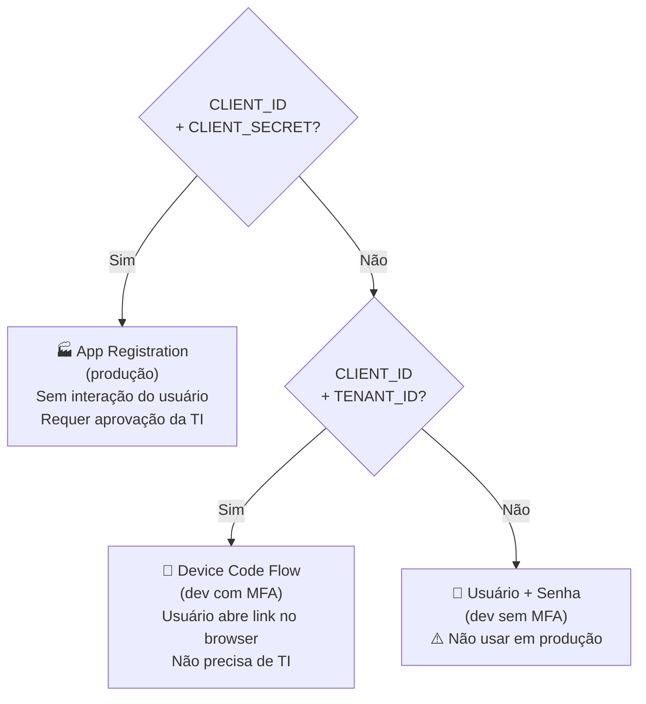

# Autenticação

#senai #chamada #auth #microsoft #msal

> [[00 - Índice|← Índice]]

---

## Modos disponíveis

O backend escolhe automaticamente o modo com base no `.env` → ver [[13 - Variáveis de Ambiente]].



---

## `auth/microsoft_context.py`

```python
def get_sharepoint_context() -> ClientContext:
    if settings.CLIENT_ID and settings.CLIENT_SECRET:
        # Modo produção
        return ClientContext(settings.SHAREPOINT_URL).with_credentials(
            ClientCredential(settings.CLIENT_ID, settings.CLIENT_SECRET)
        )
    if settings.CLIENT_ID and settings.TENANT_ID:
        # Device Code Flow
        return ClientContext(settings.SHAREPOINT_URL).with_interactive(
            tenant=settings.TENANT_ID,
            client_id=settings.CLIENT_ID,
            callback=_device_code_callback
        )
    if settings.SP_USERNAME and settings.SP_PASSWORD:
        # Usuário + senha
        return ClientContext(settings.SHAREPOINT_URL).with_credentials(
            UserCredential(settings.SP_USERNAME, settings.SP_PASSWORD)
        )
    raise ValueError("Nenhuma credencial configurada no .env")
```

---

## Validação de JWT — `auth/token_validator.py`

> Planejado para quando o frontend tiver MSAL.js integrado.

- Busca chaves públicas em `login.microsoftonline.com/{TENANT_ID}/discovery/v2.0/keys`
- Decodifica o token com `python-jose` usando `RS256`
- Retorna o payload (claims do usuário)

---

## Controle de roles — `auth/permissions.py`

```python
def exigir_role(*roles: str):
    async def verificar(usuario: dict = Depends(validar_token)):
        role_usuario = usuario.get("roles", [])
        if not any(r in role_usuario for r in roles):
            raise HTTPException(status_code=403, detail="Sem permissão.")
        return usuario
    return verificar
```

**Roles usados no sistema:**

| Role | Acesso |
|---|---|
| `professor` | Fazer chamada, ver relatórios |
| `admin` | Tudo + importar alunos + CRUD |

---

## Links relacionados

- [[03 - Arquitetura]] — fluxo completo de autenticação (sequência)
- [[07 - Backend FastAPI]] — como os routers usam `Depends(exigir_role(...))`
- [[13 - Variáveis de Ambiente]] — quais variáveis ativam cada modo
- [[15 - Próximos Passos]] — migração para MSAL completo
