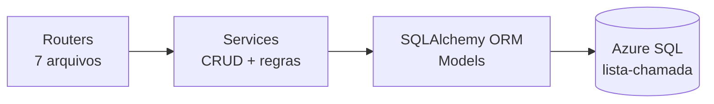

# Backend — FastAPI

#senai #chamada #backend #fastapi #python #sqlalchemy

> [[00 - Índice|← Índice]]

Localização: `backend-python/`
Entry point: `uvicorn app.main:app --reload`

---

## Arquitetura em camadas



Routers → Services → ORM → Azure SQL.
Nenhuma lógica de negócio nos routers; nenhuma query SQL nos routers.

---

## `app/database.py`

```python
engine = create_engine(
    DATABASE_URL,          # lido do .env
    pool_pre_ping=True,
    pool_size=10,
    max_overflow=20,
    connect_args={"login_timeout": 60, "timeout": 60},
)
```

`get_db()` injeta a `Session` via `Depends(get_db)` em cada endpoint.
`DATABASE_URL` obrigatória — `RuntimeError` se ausente.

> Variáveis → [[13 - Variáveis de Ambiente]]

---

## Models (`app/models/`)

Mapeamento direto ao schema do banco. Todos usam `DeclarativeBase`.

| Arquivo | Classe(s) | Tabela(s) |
|---|---|---|
| `role.py` | `Role` | `roles` |
| `usuario.py` | `Usuario` | `usuarios` |
| `curso.py` | `Curso` | `cursos` |
| `turma.py` | `Turma` | `turma` |
| `aluno.py` | `Aluno` | `alunos` |
| `turma_disciplina.py` | `TurmaDisciplina` | `turma_disciplina` |
| `aluno_disciplina_extra.py` | `AlunoDisciplinaExtra` | `aluno_disciplina_extra` |
| `sessao_aula.py` | `SessaoAula` | `sessao_aula` |
| `presenca.py` | `PresencaAluno` | `presenca_alunos` |

Todos os models têm `relationship()` bidirecionais configurados.
Schema completo → [[05 - Schema Azure SQL]]

---

## Schemas (`app/schemas/`) — Pydantic v2

Padrão: `Base → Create → Update → Response` para cada entidade.
`Response` usa `ConfigDict(from_attributes=True)` para serializar ORM objects.

| Arquivo | Schemas principais |
|---|---|
| `curso.py` | `CursoCreate`, `CursoUpdate`, `CursoResponse` |
| `turma.py` | `TurmaCreate` (`curso_id`), `TurmaResponse` |
| `aluno.py` | `AlunoCreate`, `AlunoUpdate`, `AlunoResponse` |
| `usuario.py` | `UsuarioCreate`, `UsuarioUpdate`, `UsuarioResponse` |
| `turma_disciplina.py` | `TurmaDisciplinaCreate`, `TurmaDisciplinaResponse` |
| `sessao_aula.py` | `SessaoAulaCreate`, `SessaoAulaResponse`, `AlunosSessaoResponse` |
| `presenca.py` | `PresencaCreate`, `PresencaUpdate`, `PresencaResponse`, `ChamadaLoteCreate` |

---

## Services (`app/services/`)

Todos recebem `db: Session` como primeiro parâmetro.
Escrita sempre com `try / except → db.rollback() / raise`.
Soft delete: `ativo = False`, nunca `DELETE`.

### `curso_service.py`
`listar`, `buscar`, `criar`, `atualizar`, `desativar`

### `turma_service.py`
`listar`, `buscar`, `criar` (verifica `cod_turma` duplicado → 409), `atualizar`, `desativar`

### `aluno_service.py`
`listar` (filtro `turma_id`), `buscar`, `criar` (verifica `ra` duplicado → 409), `atualizar`, `desativar`

### `usuario_service.py`
`listar`, `buscar`, `buscar_por_email`, `criar` (verifica email duplicado → 409), `atualizar`, `desativar`

### `turma_disciplina_service.py`
`listar` (filtros `turma_id`, `dia_semana`), `buscar`, `criar` (verifica `uq_turma_disciplina` → 409), `atualizar`, `desativar`

### `sessao_aula_service.py`

| Método | Comportamento |
|---|---|
| `criar_ou_buscar(db, dados)` | Cria sessão se não existe; retorna existente se já foi criada (idempotente) |
| `buscar(db, sessao_id)` | 404 se não encontrado |
| `listar(db, turma_disciplina_id, data_aula)` | Filtros opcionais |
| `alunos_da_sessao(db, sessao_id)` | Retorna `{"alunos_turma": [...], "alunos_extra": [...]}` — alunos da turma + alunos de `aluno_disciplina_extra` para aquele `curso_id` |
| `atualizar(db, sessao_id, dados)` | Atualiza `observacao` |

### `chamada_service.py`

| Método | Comportamento |
|---|---|
| `registrar(db, dados)` | Cria presença única — 409 se duplicata |
| `registrar_lote(db, sessao_id, items)` | **Upsert em lote**: atualiza se já existe, cria se não existe |
| `atualizar(db, presenca_id, dados)` | Corrige `presente` ou `observacao` |
| `listar_por_sessao(db, sessao_id)` | Todas as presenças de uma sessão |
| `buscar(db, presenca_id)` | 404 se não encontrado |

---

## Routers e Endpoints

### `/cursos`

| Método | Path | Descrição | Status |
|---|---|---|---|
| GET | `/cursos/` | Listar (filtro `apenas_ativos`) | 200 |
| GET | `/cursos/{id}` | Buscar | 200 / 404 |
| POST | `/cursos/` | Criar | 201 |
| PATCH | `/cursos/{id}` | Atualizar | 200 / 404 |
| DELETE | `/cursos/{id}` | Soft delete | 204 / 404 |

### `/turmas`

| Método | Path | Descrição | Status |
|---|---|---|---|
| GET | `/turmas/` | Listar | 200 |
| GET | `/turmas/{id}` | Buscar | 200 / 404 |
| POST | `/turmas/` | Criar (`curso_id`) | 201 / 409 |
| PATCH | `/turmas/{id}` | Atualizar | 200 / 404 |
| DELETE | `/turmas/{id}` | Soft delete | 204 / 404 |

### `/alunos`

| Método | Path | Descrição | Status |
|---|---|---|---|
| GET | `/alunos/` | Listar (filtro `turma_id`) | 200 |
| GET | `/alunos/{id}` | Buscar | 200 / 404 |
| POST | `/alunos/` | Criar | 201 / 409 |
| PATCH | `/alunos/{id}` | Atualizar | 200 / 404 |
| DELETE | `/alunos/{id}` | Soft delete | 204 / 404 |

### `/usuarios`

| Método | Path | Descrição | Status |
|---|---|---|---|
| GET | `/usuarios/` | Listar | 200 |
| GET | `/usuarios/{id}` | Buscar | 200 / 404 |
| POST | `/usuarios/` | Criar | 201 / 409 |
| PATCH | `/usuarios/{id}` | Atualizar | 200 / 404 |
| DELETE | `/usuarios/{id}` | Soft delete | 204 / 404 |

### `/turma-disciplinas`

| Método | Path | Descrição | Status |
|---|---|---|---|
| GET | `/turma-disciplinas/hoje` | Disciplinas do dia (weekday automático) | 200 |
| GET | `/turma-disciplinas/` | Listar (filtros `turma_id`, `dia_semana`) | 200 |
| GET | `/turma-disciplinas/{id}` | Buscar | 200 / 404 |
| POST | `/turma-disciplinas/` | Criar | 201 / 409 |
| PATCH | `/turma-disciplinas/{id}` | Atualizar | 200 / 404 |
| DELETE | `/turma-disciplinas/{id}` | Soft delete | 204 / 404 |

### `/sessoes`

| Método | Path | Descrição | Status |
|---|---|---|---|
| POST | `/sessoes/` | Criar ou retornar sessão existente (idempotente) | 200 |
| GET | `/sessoes/` | Listar (filtros `turma_disciplina_id`, `data_aula`) | 200 |
| GET | `/sessoes/{id}` | Buscar sessão | 200 / 404 |
| GET | `/sessoes/{id}/alunos` | Alunos da turma + extras | 200 / 404 |
| PATCH | `/sessoes/{id}` | Atualizar observação | 200 / 404 |

### `/chamadas`

| Método | Path | Descrição | Status |
|---|---|---|---|
| POST | `/chamadas/lote` | Salvar chamada completa (upsert por aluno) | 200 |
| GET | `/chamadas/sessao/{sessao_id}` | Ver presenças de uma sessão | 200 |
| POST | `/chamadas/` | Registrar presença única | 201 / 409 |
| PATCH | `/chamadas/{id}` | Corrigir presença | 200 / 404 |

---

## Fluxo completo da chamada

```
1. GET  /turma-disciplinas/hoje
        → lista disciplinas do dia (dia_semana = weekday())

2. POST /sessoes  { turma_disciplina_id, professor_id, data_aula }
        → cria sessão ou retorna existente (idempotente)

3. GET  /sessoes/{id}/alunos
        → { alunos_turma: [...], alunos_extra: [...] }

4. POST /chamadas/lote  { sessao_id, presencas: [{aluno_id, presente}] }
        → upsert — pode ser chamado múltiplas vezes sem duplicata

5. GET  /chamadas/sessao/{sessao_id}
        → resultado final da chamada
```

---

## `app/main.py`

```python
app.include_router(cursos.router)           # /cursos
app.include_router(turmas.router)           # /turmas
app.include_router(alunos.router)           # /alunos
app.include_router(usuarios.router)         # /usuarios
app.include_router(turma_disciplinas.router) # /turma-disciplinas
app.include_router(sessoes.router)          # /sessoes
app.include_router(chamadas.router)         # /chamadas
```

CORS liberado para `http://localhost:5173`.
`GET /health` → `{"status": "ok"}`
Documentação automática: `http://localhost:8000/docs`

---

## Links relacionados

- [[05 - Schema Azure SQL]] — tabelas e constraints
- [[13 - Variáveis de Ambiente]] — `DATABASE_URL`
- [[14 - Dependências]] — `pymssql`, `SQLAlchemy`, `FastAPI`
