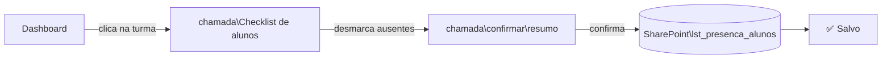
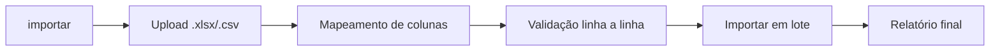

# Páginas do Sistema

#senai #chamada #frontend #rotas #ux

> [[00 - Índice|← Índice]]

---

## Mapa de páginas

| Página | Rota | Role | Descrição |
|---|---|---|---|
| Login | `/login` | público | Botão "Entrar com Microsoft" |
| Dashboard | `/` | todos | Turmas do professor |
| Fazer chamada | `/chamada` | professor, admin | Checklist de alunos |
| Confirmar chamada | `/chamada/confirmar` | professor, admin | Resumo antes de salvar |
| Relatório | `/relatorio` | professor, admin | Presença por turma e data |
| Importar alunos | `/importar` | admin | Upload Excel |
| Gerenciar alunos | `/alunos` | admin | CRUD de alunos |

---

## Fluxo do professor (caminho mais rápido)

---

## Fluxo do admin — importar alunos

> Detalhes do parse em [[10 - Import de Excel]]

---

## Proteção de rotas

O arquivo `lib/auth/guard.ts` redireciona para `/login` se:
- Usuário não autenticado
- Role insuficiente para a rota

---

## Links relacionados

- [[08 - Frontend SvelteKit]] — stores e componentes usados
- [[06 - Autenticação]] — roles e proteção
- [[10 - Import de Excel]] — página `/importar` em detalhes
