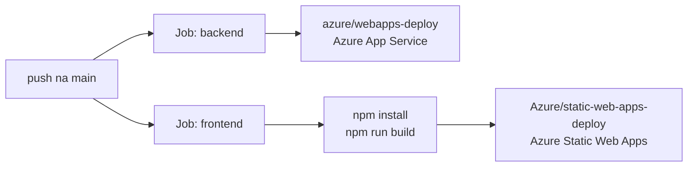

# CI/CD

#senai #chamada #cicd #github-actions #deploy

> [[00 - Índice|← Índice]]

---

## Pipeline — `.github/workflows/deploy.yml`

Deploy automático a cada push na branch `main`.



---

## Secrets necessários no GitHub

| Secret | Usado por |
|---|---|
| `AZURE_PUBLISH_PROFILE` | Deploy do backend (App Service) |
| `AZURE_STATIC_TOKEN` | Deploy do frontend (Static Web Apps) |

> Configurar em: **Settings → Secrets and variables → Actions**

---

## Estrutura do workflow

```yaml
on:
  push:
    branches: [main]

jobs:
  backend:
    # deploy para Azure App Service
    # package: ./backend

  frontend:
    # build SvelteKit
    # deploy para Azure Static Web Apps
    # app_location: "frontend"
    # output_location: "build"
```

---

## Links relacionados

- [[11 - Hospedagem]] — serviços Azure utilizados
- [[13 - Variáveis de Ambiente]] — variáveis de produção
